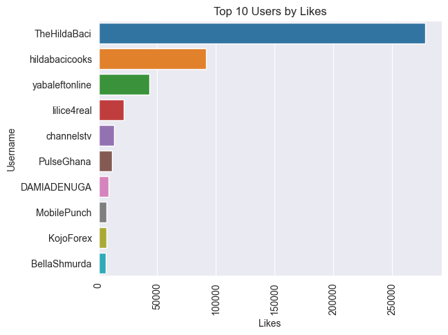
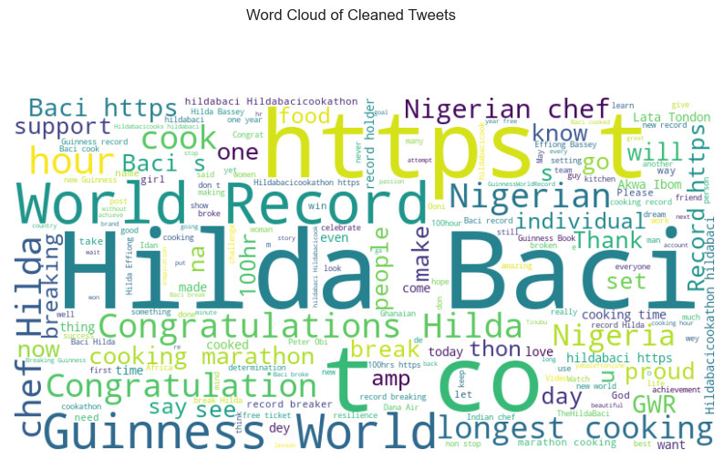
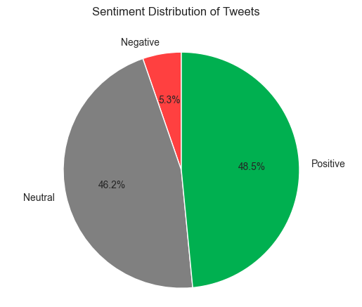

# Analyzing Twitter Sentiment on Hilda Bacci's 100-Hour Cooking Record Using Python, Seaborn, and VADER

## Introduction:
The world was captivated when culinary enthusiast Hilda Bacci set a new record by cooking continuously for 100 hours. As social media platforms exploded with discussions and reactions, analyzing Twitter sentiment became an intriguing task. In this project, we delve into the vast sea of tweets surrounding this extraordinary feat, employing Python, Seaborn, and the VADER sentiment analysis tool.

## Objective:
Our primary objective is to gain insights into the sentiments expressed in tweets related to Hilda Bacci's 100-hour cooking record. By leveraging the power of Python, we will harness the capabilities of Seaborn, a popular visualization library, and VADER, a renowned sentiment analysis model specifically designed for social media texts. Through this analysis, we aim to uncover the overall sentiment, identify trends, and explore the emotions associated with this remarkable culinary achievement.

## Methodology:

First of all we scraped about 10,000 tweets on the hashtag `#hildabaci` .

We used Python, a versatile programming language known for its extensive ecosystem of data analysis tools. Using the snscrape library, we will scrape a large collection of tweets containing relevant keywords and hashtags. The gathered data will be preprocessed, cleaning it of unnecessary elements while retaining crucial information such as the tweet content, date, and username.

To gain a deeper understanding of the sentiment behind the tweets, we will utilize VADER (Valence Aware Dictionary and Sentiment Reasoner), a pre-trained sentiment analysis model specifically designed for social media texts. VADER provides a compound sentiment score that ranges from -1 (negative) to +1 (positive), enabling us to quantify the sentiment expressed in each tweet.

With the sentiment scores obtained, we will employ Seaborn, a powerful data visualization library built on top of Matplotlib, to create visually appealing and insightful plots. We will generate various plots, including sentiment distribution, sentiment trends over time, and word clouds to visualize the most frequent sentiment-associated terms in the tweets.

## Visualizations

### Most Popular Users (by no of likes)

### Most common occuring words in Tweets

### Sentiment Distribution(VADER)
`Positive`: > 0.5 , `Negative`: < -0.5 , `Neutral` -0.5 < value < 0.5

